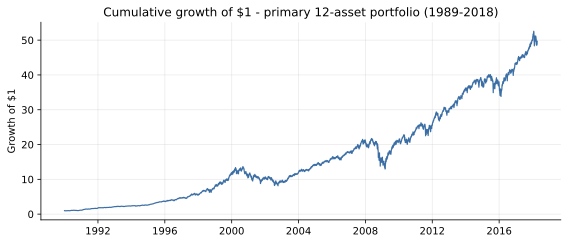
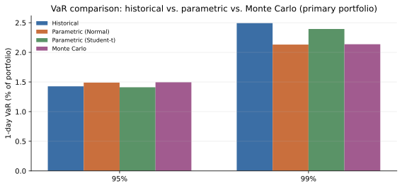
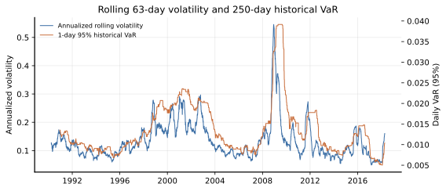
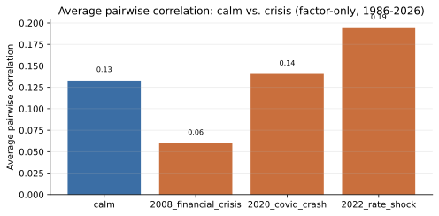

# Portfolio Risk Dashboard

Quantify how a multi-asset portfolio's risk actually behaves — not just its expected
return. Point-estimate risk models (a single VaR number) routinely disagree with each
other by 30-50% at the same confidence level, and that disagreement is largest exactly
when it matters: during a crisis. This project builds a 12-asset portfolio from real
daily market data, computes Value-at-Risk and Expected Shortfall three different ways
(historical simulation, parametric variance-covariance, Monte Carlo), and shows where
each method breaks down using the 2008 financial crisis, the 2020 COVID crash, and the
2022 rate-shock selloff as real historical test cases — rather than assuming a textbook
normal distribution and hoping it holds.

## Methodology

- **Portfolio**: a 12-asset book (`portfolio.yaml`) split roughly 60/40 between four
  asset-class factor proxies (broad equity, growth-tilted equity, a 10-year Treasury
  bond proxy, and WTI crude oil as a commodity diversifier) and eight individual
  stocks spanning technology, energy, financials, healthcare, consumer staples,
  industrials, and telecom (Apple, ExxonMobil, JPMorgan Chase, Pfizer, Walmart,
  General Electric, Bank of America, AT&T).
- **VaR / Expected Shortfall**, at 95% and 99% confidence, computed three ways:
  - *Historical simulation*: the empirical quantile of realized portfolio returns —
    makes no distributional assumption, but is only as good as the sample history.
  - *Parametric (variance-covariance)*: closed-form Normal and Student-t formulas
    from the sample mean/variance — fast, but the Normal case cannot represent fat
    tails or skew.
  - *Monte Carlo*: 20,000-50,000 simulated daily portfolio returns from a
    multivariate Normal fit to the asset covariance matrix via Cholesky
    decomposition (a discrete-step correlated GBM), then read off empirically.
- **Rolling risk**: 63-day annualized volatility and a 250-day rolling historical
  VaR, to see risk regimes shift between calm and stressed periods rather than one
  static number.
- **Factor attribution**: an OLS regression of portfolio returns on three factors
  (equity market, rates/bond proxy, commodity), reporting betas, R², and each
  factor's approximate share of portfolio variance.
- **Correlation regimes**: average pairwise correlation compared between a calm
  2013-2014 window and each crisis window, testing the "correlations go to 1 in a
  crisis" claim directly rather than assuming it.
- **Concentration**: Herfindahl-Hirschman Index of the portfolio weights.
- **Historical stress tests**: the actual realized return sequences from the 2008
  crisis, the March 2020 COVID crash, and the 2022 rate-shock selloff, replayed
  against the *current* portfolio weights, plus the worst real 1/5/10/20-day
  drawdown found anywhere in the primary portfolio's history.

### Data sources and an important substitution

The original plan was to pull SPY/QQQ/TLT/GLD and individual-stock OHLCV from
stooq.com and Yahoo Finance. Neither was usable from the build environment: stooq
now requires solving a client-side JavaScript proof-of-work challenge before
serving its CSV endpoint (not something this project will do), and Yahoo's
endpoints returned persistent HTTP 429s at the network level. Instead, all data is
sourced from two places that are freely and reliably fetchable without an API key:

1. **FRED** (Federal Reserve Economic Data) for four long-history factor series:
   NASDAQ Composite (`NASDAQCOM`, since 1971, used as the broad equity market
   factor in place of SPY), NASDAQ-100 (`NASDAQ100`, since 1986, growth tilt in
   place of QQQ), the 10-year Treasury constant-maturity yield (`DGS10`, since
   1962), and WTI crude oil (`DCOILWTICO`, since 1986, standing in for gold —
   FRED's LBMA gold series has been discontinued).
2. A **public historical stock-price CSV** (real adjusted-close data for AAPL,
   XOM, JPM, PFE, WMT, GE, BAC, T and others, 1989-2018) used for the eight
   individual-name holdings.

The 10-year Treasury yield is not a total-return series, so it is converted to an
approximate daily bond-return proxy via a standard duration approximation:
`return = prior_yield/252 - duration × Δyield` (see
`risk_dashboard/data.py:bond_return_from_yield`, duration assumed constant at 7.5
years). This is a documented modeling simplification, not observed ETF prices.

Because the individual-stock source ends 2018-04-11, two overlapping windows are
used throughout:
- **Primary window** (1989-12-29 to 2018-04-11): all 12 assets, used for VaR/ES,
  rolling risk, factor attribution, the full correlation matrix, concentration,
  and the 2008 stress test.
- **Extended window** (1986-01-02 to 2026-06-29): the four factor-only assets,
  weights renormalized to sum to 1, used to extend the correlation-regime
  comparison and stress testing to the 2020 and 2022 windows that the individual
  stocks don't reach.

Every fetch tries the live source first and falls back to a bundled cached CSV
(`src/risk_dashboard/cache_data/`) if the network call fails or returns something
that isn't real data (e.g. an HTML challenge page) — the dashboard runs the same
way online or fully offline.

## Install & usage

```bash
python3 -m venv .venv && source .venv/bin/activate
pip install -e .

# Run the test suite
pytest -q

# Generate the self-contained HTML risk report (tries live data, falls back to cache)
python -m risk_dashboard.report --config portfolio.yaml --out reports/risk_report.html --n-sims 50000

# Or force the bundled cached data (no network calls at all) -- this is the exact
# command used to produce reports/risk_report.html and the Results section below
python -m risk_dashboard.report --config portfolio.yaml --out reports/risk_report.html --offline --n-sims 50000
```

`--n-sims` defaults to 20,000 if omitted; the Monte Carlo VaR/ES figures below use
50,000 and will differ slightly (Monte Carlo sampling noise, same fixed seed) at the
default.

Open `reports/risk_report.html` in a browser — every chart is inline SVG, no
external assets or JavaScript.

## Results

All figures below are from an actual run against the bundled cached data
(`--offline`), 50,000 Monte Carlo simulations. Daily returns.

**VaR / Expected Shortfall — primary 12-asset portfolio (1989-2018)**

| Method | VaR 95% | ES 95% | VaR 99% | ES 99% |
|---|---|---|---|---|
| Historical | 1.43% | 2.16% | 2.49% | 3.47% |
| Parametric (Normal) | 1.49% | 1.88% | 2.13% | 2.45% |
| Parametric (Student-t, df=5) | 1.41% | 2.05% | 2.39% | 3.19% |
| Monte Carlo | 1.50% | 1.88% | 2.14% | 2.45% |

The Normal parametric model tracks historical simulation reasonably well at 95%,
but at 99% its Expected Shortfall (2.45%) understates the historical figure
(3.47%) by **29%** — the Normal distribution's thin tails can't represent the
fat left tail this portfolio actually realized in 2008. Monte Carlo, built on a
Gaussian assumption, converges to essentially the same (understated) number as
the Normal parametric model rather than to the historical figure, which is
exactly what the theory predicts: it's only as good as its distributional
assumption. Student-t (5 df) closes most of the gap without needing the full
empirical history.

**Factor attribution** (portfolio returns regressed on market / rates / commodity)

| Factor | Beta | % of portfolio variance |
|---|---|---|
| Equity market (NASDAQ Composite) | 0.582 | 78.2% |
| Bond proxy (10Y Treasury) | 0.192 | 0.7% |
| Commodity (WTI oil) | 0.101 | 6.8% |
| Residual / idiosyncratic | — | 14.3% |

R² = 0.862. Unsurprisingly for a 40%-in-single-stocks book, equity market beta
dominates; the bond and commodity factors contribute comparatively little
systematic variance, and single-name idiosyncratic risk (GE and Bank of America
both had extreme, largely idiosyncratic drawdowns in this sample) still accounts
for over a seventh of total variance.

**Correlation regime: calm vs. crisis**

| Period | Avg. pairwise correlation (12-asset) | Avg. pairwise correlation (4-factor) |
|---|---|---|
| Calm (2013-2014) | 0.264 | 0.133 |
| 2008 financial crisis | 0.416 | 0.060 |
| 2020 COVID crash | — | 0.141 |
| 2022 rate shock | — | 0.194 |

The classic "correlations go to 1 in a crisis" effect shows up clearly across the
stock-heavy 12-asset book (0.264 → 0.416): individual equities move together much
more in a selloff. But the 4-factor cross-asset-class view tells a more nuanced
story in 2008 specifically: average correlation *fell* (0.133 → 0.060), because
Treasuries rallied sharply (flight-to-quality) while equities and oil collapsed,
pulling the average down despite equities themselves correlating tightly. 2020 and
2022 show smaller, positive increases instead. The takeaway: single-asset-class
diversification benefits shrink in a crisis, but a genuine cross-asset hedge
(government bonds) can decouple *further* — which is precisely why it's a hedge.

**Historical stress tests (current weights, real historical return sequences)**

| Scenario | Window | Weight coverage | Cumulative P&L | Worst single day |
|---|---|---|---|---|
| 2008 financial crisis | 2008-09-01 to 2009-03-09 | 100% (all 12 assets) | **-36.7%** | -7.6% (2008-09-29) |
| 2020 COVID crash | 2020-02-19 to 2020-03-23 | 60% (4 factors only) | **-22.7%** | -7.2% |
| 2022 rate shock | 2022-01-01 to 2022-10-14 | 60% (4 factors only) | **-18.8%** | -3.0% |

Worst day, -7.6% on 2008-09-29, coincides with the day the U.S. House rejected the
initial TARP bill and the Dow fell almost 778 points — a real, identifiable event,
not a simulated tail.

**Worst realized N-day drawdowns, primary portfolio**

| Window | Return | Period |
|---|---|---|
| 1-day | -7.6% | 2008-09-29 |
| 5-day | -13.7% | 2008-11-13 to 2008-11-20 |
| 10-day | -18.4% | 2008-09-25 to 2008-10-09 |
| 20-day | -20.8% | 2008-09-26 to 2008-10-24 |

**Concentration**: Herfindahl-Hirschman Index = 0.122 (vs. 0.083 for an equal-weight
12-asset benchmark) — moderately concentrated, driven by the 20% weights on the
equity-market and bond factors.

Charts (generated by `scripts/generate_report_assets.py` from the same run):






## Limitations & next steps

- **Substituted tickers, not SPY/QQQ/TLT/GLD**: as explained above, stooq's
  anti-bot challenge and Yahoo Finance's rate limiting made the originally
  planned tickers unreachable from this environment; FRED index/yield series and
  WTI oil stand in for the broad-market, growth, bond, and gold legs. The
  methodology is identical to what it would be with the literal ETFs — only the
  specific proxy series differ.
- **Bond returns are a modeled approximation**, not an observed total-return
  series (see `bond_return_from_yield`), and assume a constant 7.5-year duration.
- **Individual-stock history stops 2018-04-11**, the end date of the free
  historical-price dataset used; the 2020 and 2022 stress tests therefore only
  cover the four factor-proxy assets (60% of portfolio weight), renormalized —
  not the full 12-asset book.
- **Variance attribution per factor** uses the standard "ignore cross-covariance"
  approximation (`beta² × var(factor) / var(portfolio)`), which is only exact for
  uncorrelated factors; the reported residual share absorbs the gap.
- **Next steps**: swap in a real total-return bond series and literal gold/ETF
  prices if a reachable source becomes available; extend individual-stock history
  to the present via a paid or key-gated data vendor; add a GARCH or EWMA
  volatility model to the rolling-risk section; backtest VaR breach rates
  (Kupiec/Christoffersen tests) to formally validate each method's calibration.
